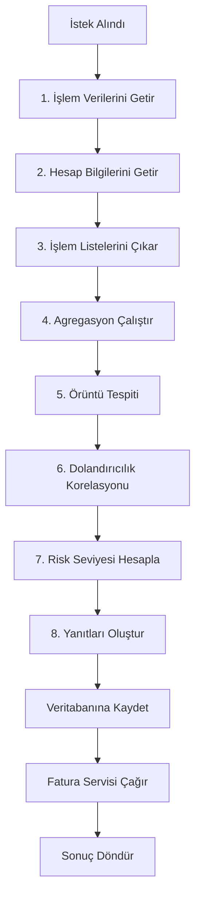

# Analysis Service - Akademik Proje Raporu

## 📋 Proje Özeti

**Analysis Service**, ModernBank bankacılık platformunun kritik bir mikroservisi olarak, kullanıcı işlem verilerinin kapsamlı analizini gerçekleştiren, dolandırıcılık tespit eden ve yapay zeka destekli raporlar üreten bir Spring Boot uygulamasıdır.

| Özellik | Değer |
|---------|-------|
| **Framework** | Spring Boot 3.2.0 |
| **Programlama Dili** | Java 17 |
| **Veritabanı** | MySQL |
| **Servis İletişimi** | OpenFeign |
| **AI Entegrasyonu** | Google Gemini API |
| **Port** | 8051 (varsayılan) |

---

## 🏗️ Sistem Mimarisi

Aşağıdaki diyagram, Analysis Service'in genel mimarisini göstermektedir:


### Katmanlı Mimari Yapısı

Proje, **Katmanlı Mimari (Layered Architecture)** prensiplerini takip eder:

```
┌─────────────────────────────────────────────────────────────┐
│                    API/Controller Katmanı                    │
│                     AnalysisController                       │
├─────────────────────────────────────────────────────────────┤
│                   Orkestrasyon Katmanı                       │
│                    AnalysisOrchestrator                      │
├─────────────────────────────────────────────────────────────┤
│                     Servis Katmanı                           │
│  Aggregation │ PatternDetection │ FraudCorrelation │ Risk   │
├─────────────────────────────────────────────────────────────┤
│                    Builder Katmanı                           │
│        FrontendResponseBuilder │ InvoicePayloadBuilder       │
├─────────────────────────────────────────────────────────────┤
│                     Client Katmanı                           │
│    TransactionClient │ AccountClient │ InvoiceClient         │
├─────────────────────────────────────────────────────────────┤
│                  Veritabanı Katmanı                          │
│                    MySQL (JPA/Hibernate)                     │
└─────────────────────────────────────────────────────────────┘
```

---

## 📂 Proje Yapısı

```
analysis-service/
├── src/main/java/com/modernbank/analyze_service/
│   ├── api/                    # API kontratları ve DTO'lar
│   │   ├── request/            # İstek modelleri
│   │   ├── response/           # Yanıt modelleri
│   │   └── dto/                # Veri transfer nesneleri
│   ├── builder/                # Response builder sınıfları
│   ├── client/                 # Feign client tanımlamaları
│   ├── config/                 # Konfigürasyon sınıfları
│   ├── controller/             # REST Controller
│   ├── entity/                 # JPA Entity sınıfları
│   ├── exception/              # Özel exception sınıfları
│   ├── model/                  # Domain modelleri
│   ├── orchestrator/           # İş akışı koordinatörü
│   ├── repository/             # JPA Repository
│   └── service/                # İş mantığı servisleri
│       ├── ai/                 # Yapay zeka servisleri
│       ├── analysis/           # Analiz servisleri
│       └── impl/               # Implementasyonlar
├── pom.xml                     # Maven bağımlılıkları
└── Dockerfile                  # Container tanımı
```

---

## 🔄 Ana İş Akışı

### Analiz Pipeline (8-Adımlı Süreç)

`AnalysisOrchestrator` sınıfı, tüm analiz sürecini koordine eder:



### Adım Detayları

| Adım | Servis | Açıklama |
|------|--------|----------|
| 1 | `TransactionServiceClient` | Transaction Service'den işlem verilerini çeker |
| 2 | `AccountServiceClient` | Account Service'den hesap bilgilerini çeker |
| 3 | Orkestratör | Mevcut ve önceki dönem işlemlerini ayırır |
| 4 | `AggregationService` | Toplam gelen/giden tutarları, işlem sayılarını hesaplar |
| 5 | `PatternDetectionService` | Şüpheli davranış örüntülerini tespit eder |
| 6 | `FraudCorrelationService` | Dolandırıcılık sinyallerini ilişkilendirir |
| 7 | `RiskLevelCalculator` | Genel risk seviyesini belirler (LOW/MEDIUM/HIGH) |
| 8 | Builder Servisleri | Kullanıcı yanıtı ve fatura payload'ını oluşturur |

---

## 🧩 Temel Bileşenler

### 1. AnalysisController

REST API endpoint'lerini yöneten controller sınıfı.

| Endpoint | Method | Açıklama |
|----------|--------|----------|
| `/api/v1/analysis/transactions` | POST | İşlem analizi başlatır |
| `/api/v1/analysis/reports` | GET | Kullanıcının analiz raporlarını getirir |
| `/api/v1/analysis/invoice` | PUT | Fatura ID'sini günceller |

### 2. Analiz Servisleri

#### AggregationService
- İşlem miktarlarını toplar
- Gelen/giden para akışını hesaplar
- Yüksek riskli işlem sayısını belirler

#### PatternDetectionService
- Kural tabanlı örüntü tespiti yapar
- Mevcut ve önceki dönem karşılaştırması
- Anormallik tespiti (unusual pattern detection)

#### FraudCorrelationService
- Dolandırıcılık sinyallerini birleştirir
- Yüksek riskli işlemleri tanımlar
- Dominant dolandırıcılık kalıplarını çıkarır

#### RiskLevelCalculator
- Tüm analizleri değerlendirir
- Genel risk seviyesi: **LOW**, **MEDIUM**, **HIGH**
- Ağırlıklı puanlama algoritması kullanır

### 3. Builder Servisleri

#### FrontendResponseBuilder
- Kullanıcı dostu yanıt oluşturur
- Gemini AI ile Türkçe özet üretir
- İstatistikler ve bulgular hazırlar

#### InvoicePayloadBuilder
- Fatura servisi için payload oluşturur
- Deterministik veri yapısı sağlar
- Hesap özetleri ve işlem detayları içerir

### 4. AI Entegrasyonu

`AiSummaryService` Google Gemini API kullanarak:
- Türkçe profesyonel özet üretir
- Sakin ve bilgilendirici ton kullanır
- 3-5 cümlelik açıklama oluşturur

---

## 💾 Veri Modeli

### AnalysisReportEntity

```java
@Entity
@Table(name = "analysis_reports")
public class AnalysisReportEntity {
    private String id;                    // UUID
    private String userId;                // Kullanıcı ID
    private String invoiceId;             // Fatura ID (sonradan güncellenir)
    private String analysisRange;         // Analiz aralığı
    private String overallRiskLevel;      // Risk seviyesi
    private String summary;               // Özet
    private String aiSummary;             // AI tarafından üretilen Türkçe özet
    private String keyFindings;           // Temel bulgular (JSON)
    private String userGuidance;          // Kullanıcı rehberliği
    private String flaggedTransactionIds; // İşaretli işlemler (JSON)
    private Integer totalTransactions;    // Toplam işlem sayısı
    private String totalOutgoing;         // Toplam giden
    private String totalIncoming;         // Toplam gelen
    private String netFlow;               // Net akış
    private LocalDateTime generatedAt;    // Üretilme zamanı
}
```

### Enum Tanımları

| Enum | Değerler | Açıklama |
|------|----------|----------|
| `AnalyzeRange` | LAST_7_DAYS, LAST_30_DAYS | Analiz dönemi |
| `RiskLevel` | LOW, MEDIUM, HIGH | Risk seviyesi |
| `InvoiceStatus` | PENDING, COMPLETED, FAILED | Fatura durumu |

---

## 🔗 Harici Servis Entegrasyonları

Proje, **Spring Cloud OpenFeign** kullanarak diğer mikroservislerle iletişim kurar:

### 1. Transaction Service
```java
@FeignClient(name = "transaction-service")
public interface TransactionServiceClient {
    @PostMapping("/api/v1/transactions/analyze")
    TransactionAnalyzeModel getTransactionsForAnalysis(request, headers);
}
```

### 2. Account Service
```java
@FeignClient(name = "account-service")
public interface AccountServiceClient {
    @PostMapping("/api/v1/accounts")
    AccountListResponse getAccountsByUserId(request, headers);
}
```

### 3. Invoice Service
```java
@FeignClient(name = "invoice-service")
public interface InvoiceServiceClient {
    @PostMapping("/api/invoices/generate")
    InvoiceResponse generateInvoice(request, headers);
}
```

---

## 📊 Yanıt Formatı

### AnalysisResult (API Yanıtı)

```json
{
  "analysisReportId": "uuid",
  "invoiceRequestId": "uuid",
  "invoiceStatus": "PENDING",
  "estimatedCompletionDate": "2026-01-02T12:00:00",
  "invoiceMessage": "Analiz raporunuz tahmini tamamlanma süresinde hazır olacaktır."
}
```

### AnalysisResponse (Frontend İçin)

```json
{
  "analyzeRange": "Son 7 Gün",
  "overallRiskLevel": "LOW",
  "summary": "İşlem geçmişiniz normal görünmektedir.",
  "aiSummary": "Son 7 günlük işlem analiziniz tamamlandı...",
  "keyFindings": ["Düzenli işlem kalıpları tespit edildi"],
  "userGuidance": "Herhangi bir işlem yapmanız gerekmemektedir.",
  "flaggedTransactionIds": [],
  "statistics": {
    "totalTransactions": 15,
    "totalOutgoing": "₺5.250,00",
    "totalIncoming": "₺8.750,00",
    "netFlow": "₺3.500,00"
  }
}
```

---

## 🛡️ Güvenlik ve Hata Yönetimi

### Güvenlik Önlemleri
- Header-based authentication (`USER_ID`, `USER_ROLE`, `AUTHORIZATION_TOKEN`)
- Input validation via request DTOs
- Graceful degradation (hesap servisi hata verirse analiz devam eder)

### Hata Yönetimi
- `ExternalServiceUnavailableException`: Harici servis erişim hatası
- Try-catch bloklarıyla servis çağrıları korunur
- Logging için SLF4J/Logback kullanılır

---

## 📈 İzleme ve Metrikler

Proje, **Spring Actuator** ve **Micrometer** ile izlenir:

| Endpoint | Açıklama |
|----------|----------|
| `/actuator/health` | Servis sağlık durumu |
| `/actuator/prometheus` | Prometheus metrikleri |
| `/actuator/info` | Servis bilgileri |

---

## 🔧 Teknoloji Stack

| Kategori | Teknoloji |
|----------|-----------|
| **Framework** | Spring Boot 3.2.0 |
| **Dil** | Java 17 |
| **Build Tool** | Maven |
| **ORM** | Spring Data JPA / Hibernate |
| **HTTP Client** | Spring Cloud OpenFeign |
| **Reactive** | Spring WebFlux (AI çağrıları için) |
| **Veritabanı** | MySQL |
| **AI** | Google Gemini API |
| **Monitoring** | Micrometer + Prometheus |
| **Utility** | Lombok, ModelMapper |
| **Containerization** | Docker |

---

## 📝 Sonuç

**Analysis Service**, modern bankacılık sistemleri için kritik bir bileşen olarak:

1. ✅ **Kapsamlı İşlem Analizi**: Kullanıcı işlemlerini çok boyutlu analiz eder
2. ✅ **Dolandırıcılık Tespiti**: Şüpheli aktiviteleri erken tespit eder
3. ✅ **AI Destekli Raporlama**: Kullanıcı dostu Türkçe özetler üretir
4. ✅ **Mikroservis Mimarisi**: Ölçeklenebilir ve bağımsız deployment
5. ✅ **Resilient Tasarım**: Graceful degradation ile yüksek erişilebilirlik
6. ✅ **Profesyonel İletişim**: Sakin ve bilgilendirici ton ile kullanıcı güveni

Bu servis, **SOLID prensipleri** ve **Clean Architecture** yaklaşımları takip edilerek geliştirilmiştir.

---

**Hazırlayan**: Ataberk BAKIR
**Tarih**: Ocak 2026  
**Versiyon**: 1.0.0
